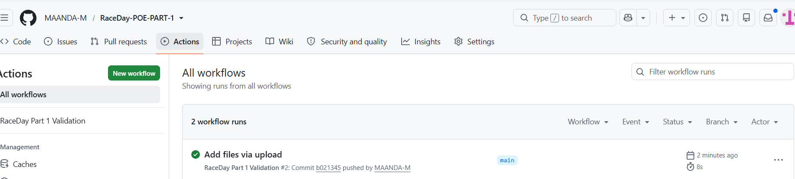

# RaceDay POE - Part 1
[](https://github.com/MAANDA-M/RaceDay-POE-PART-1/actions/workflows/validation.yml)
## System Planning and Database

### GitHub Repository

https://github.com/MAANDA-M/RaceDay-POE-PART-1

---

## Project Overview

RaceDay is a race event management system designed to allow organisers to create and manage race events, while participants can register, manage their profiles, view available events, enrol in event categories and view their race results.

This repository contains the planning and database components developed for Part 1 of the RaceDay Portfolio of Evidence (POE).

Part 1 focuses on planning the RaceDay system before application implementation by producing an Entity Relationship Diagram (ERD), a RESTful API Endpoint Plan and a SQL Server database script.

---

# Part 1 Deliverables

The following deliverables are included in Part 1:

- Entity Relationship Diagram (ERD)
- RESTful API Endpoint Plan
- SQL Server Database Script
- Realistic Sample Database Data
- GitHub Repository
- Minimum of 20 Meaningful GitHub Commits
- GitHub Actions CI/CD Validation
- Successful CI/CD Build Screenshot
- Unlisted YouTube Walkthrough Video

The ERD, API Endpoint Plan and SQL database script are stored inside the `/docs` folder of this repository.

---

# User Roles

The RaceDay system contains two main user roles:

## Organiser

An Organiser is responsible for creating and managing race events.

An Organiser can:

- Log into the RaceDay system
- View their profile
- Update their profile
- Create race events
- View race events
- Update events they own
- Delete events they own
- Create categories for their events
- Update event categories
- Delete event categories
- View participants enrolled in their events
- Manage event enrolments
- Record participant race results
- View race results

---

## Participant

A Participant is a user who participates in RaceDay events.

A Participant can:

- Register a RaceDay account
- Log into the system
- View their profile
- Update their profile
- View available race events
- View event details
- View categories belonging to an event
- Enrol in an event category
- View their enrolments
- Withdraw from an enrolment
- View race results

---

# Section A - Entity Relationship Diagram

The RaceDay database was designed as a relational database using Microsoft SQL Server.

The Entity Relationship Diagram represents the entities, attributes, primary keys, foreign keys and relationships required by the RaceDay system.

The RaceDay database contains the following six main entities:

1. Role
2. User
3. Event
4. Category
5. Enrolment
6. Result

---

## Role Entity

The `Role` entity stores the roles available in the RaceDay system.

The two main roles are:

- Organiser
- Participant

Each registered user is assigned a role.

---

## User Entity

The `User` entity stores information about registered RaceDay users.

User information includes:

- User ID
- Full Name
- Email Address
- Password Hash
- Password Salt
- Role ID
- Created Date

The Role ID is used as a foreign key to associate each user with a role.

---

## Event Entity

The `Event` entity stores information about race events.

Event information includes:

- Event ID
- Name
- Description
- Event Date
- Location
- Distance
- Event Type
- Organiser ID

Each event is associated with the Organiser who created it.

---

## Category Entity

The `Category` entity stores the different categories available for a race event.

Category information includes:

- Category ID
- Event ID
- Name
- Minimum Age
- Maximum Age
- Category Distance

Each category belongs to a specific event.

---

## Enrolment Entity

The `Enrolment` entity records Participants who enrol in race events.

Enrolment information includes:

- Enrolment ID
- Participant ID
- Event ID
- Category ID
- Enrolment Date

The Enrolment entity links a Participant to an Event and a selected Category.

---

## Result Entity

The `Result` entity stores a Participant's race result.

Result information includes:

- Result ID
- Enrolment ID
- Finish Time
- Finish Position
- Recorded Date

Each Result is associated with an Enrolment.

---

# Database Relationships

The RaceDay database contains the following main relationships:

- One Role can be assigned to many Users.
- One Organiser can organise many Events.
- One Event can contain many Categories.
- One Participant can have many Enrolments.
- One Event can have many Enrolments.
- One Category can be associated with many Enrolments.
- An Enrolment may have a Result once the Participant has completed the event.

Primary keys and foreign keys are used to maintain referential integrity between the RaceDay database tables.

---

# Section B - RESTful API Endpoint Plan

The RaceDay API Endpoint Plan documents the RESTful API endpoints that the RaceDay system will expose.

Each endpoint is planned before application code is implemented.

Every endpoint in the API Endpoint Plan contains the following information:

- HTTP Method
- Route
- Description
- Role Required
- Request Body
- Expected Response

The endpoint plan covers the following functional areas:

- Authentication
- User Profile
- Events
- Categories
- Event Enrolments
- Results

---

## Authentication Endpoints

Authentication endpoints are used to register and authenticate RaceDay users.

The planned authentication functionality includes:

- User Registration
- User Login
- JWT Authentication
- Role-Based Authorisation

Registration and login are public endpoints.

Protected endpoints require the user to be authenticated.

---

## User Profile Endpoints

User Profile endpoints allow authenticated users to:

- View their profile
- Update their profile information

Authentication is required to access and modify user profile information.

---

## Event Endpoints

Event endpoints are used to manage RaceDay events.

The planned functionality includes:

- View all events
- View a specific event
- Create an event
- Update an event
- Delete an event

Participants can view available events.

Only Organisers are allowed to create, update or delete events.

An Organiser may only modify events that they own.

---

## Category Endpoints

Category endpoints are used to manage the categories available for race events.

The planned functionality includes:

- View categories belonging to an event
- View a specific category
- Create a category
- Update a category
- Delete a category

Participants can view categories.

Organisers can create and manage categories belonging to their own events.

---

## Event Enrolment Endpoints

Event Enrolment endpoints allow Participants to enter RaceDay events.

The planned functionality includes:

- Enrol in an event category
- View enrolments
- Withdraw from an enrolment
- Allow Organisers to view Participants enrolled in their events

---

## Result Endpoints

Result endpoints are used to record and retrieve race results.

The planned functionality includes:

- Record a Participant's result
- View race results
- View the result of a specific Enrolment

Results include information such as finish time and finish position.

---

# Section C - SQL Server Database Script

The RaceDay database is implemented using Microsoft SQL Server.

The SQL Server database script creates the complete RaceDay database schema.

The database contains the following tables:

- Role
- User
- Event
- Category
- Enrolment
- Result

The SQL database structure is designed to match the RaceDay Entity Relationship Diagram.

---

# Database Constraints

The RaceDay SQL script uses database constraints to maintain data integrity.

The script includes:

- PRIMARY KEY constraints
- FOREIGN KEY constraints
- NOT NULL constraints
- UNIQUE constraints
- CHECK constraints
- DEFAULT values where required

These constraints help prevent invalid or inconsistent information from being stored in the database.

---

# Sample Data

The SQL script includes realistic sample data that can be used to test the RaceDay database.

The sample data includes at minimum:

- 2 Organisers
- 2 Participants
- 3 Events
- Categories for the events
- Sample Enrolments
- Sample Race Results

The sample data demonstrates that the RaceDay database and its relationships operate correctly.

---

# Running the SQL Database Script

The RaceDay SQL database script can be executed using Microsoft SQL Server Management Studio (SSMS).

To run the database script:

1. Open Microsoft SQL Server Management Studio.
2. Connect to a SQL Server instance.
3. Open the `RaceDay_Database_Script.sql` file.
4. Execute the entire SQL script.
5. Confirm that the RaceDay database is created successfully.
6. Confirm that all required tables are created.
7. Confirm that the sample data is inserted successfully.
8. Run the verification queries at the bottom of the SQL script.

The complete script should execute without errors.

---

## Database Verification

After executing the SQL script in SQL Server Management Studio, the database should contain the following tables:

- Role
- User
- Event
- Category
- Enrolment
- Result

The verification queries at the end of the SQL script are used to confirm that the tables were created successfully and that the sample data was inserted correctly.

A successful database setup should show the required Organisers, Participants, Events, Categories, Enrolments and Results without SQL execution errors.

---

# Technologies and Tools Used

The following technologies and tools were used during Part 1:

- Microsoft SQL Server
- SQL Server Management Studio (SSMS)
- Draw.io / diagrams.net
- Microsoft Word
- Git
- GitHub
- GitHub Actions

---

# Repository Structure

```text
RaceDay-POE-PART-1/
│
├── docs/
│   ├── RaceDay_ERD.drawio
│   ├── RaceDay_ERD.png
│   ├── API_Endpoint_Plan.pdf
│   └── RaceDay_Database_Script.sql
│
├── .github/
│   └── workflows/
│       └── validation.yml
│
└── README.md
```

---

## Quick Access to Part 1 Files

- [RaceDay ERD - PNG](docs/RaceDay_ERD.png)
- [RaceDay ERD - Editable Draw.io File](docs/RaceDay_ERD.drawio)
- [API Endpoint Plan](docs/API_Endpoint_Plan.pdf)
- [SQL Database Script](docs/RaceDay_Database_Script.sql)

---

## RaceDay Entity Relationship Diagram

The RaceDay ERD shows:

- Database entities
- Entity attributes
- Primary keys
- Foreign keys
- Relationships
- Relationship cardinality

The editable Draw.io version is stored as:

`/docs/RaceDay_ERD.drawio`

The required PNG submission version is stored as:

`/docs/RaceDay_ERD.png`

---

## RaceDay API Endpoint Plan

The API Endpoint Plan contains the planned RaceDay RESTful API endpoints.

Every endpoint includes:

- HTTP Method
- Route
- Description
- Role Required
- Request Body
- Expected Response

File:

`/docs/API_Endpoint_Plan.pdf`

---

## RaceDay Database Script

The SQL Server database script contains:

- Database creation
- Table creation
- Primary keys
- Foreign keys
- Database constraints
- Sample data
- Verification queries

File:

`/docs/RaceDay_Database_Script.sql`

---

# GitHub Version Control

GitHub is used to manage the RaceDay Part 1 project and maintain a record of project development.

The repository uses meaningful commits to document the changes made during the development of Part 1.

A minimum of 20 meaningful commits will be completed using the student's own GitHub account.

---

# GitHub Actions CI/CD

GitHub Actions is used to validate the structure of the RaceDay Part 1 repository.

The CI/CD workflow checks that the required Part 1 files and folders are available in the repository.

The workflow validates the presence of:

- `/docs` folder
- RaceDay ERD PNG or PDF
- RaceDay API Endpoint Plan
- RaceDay SQL Database Script
- README file

---

## Successful CI/CD Build

The GitHub Actions workflow was executed successfully and validated that the required RaceDay Part 1 files are present in the repository.

The successful workflow confirms that the repository contains the required documentation, including the ERD, API Endpoint Plan, SQL Database Script and README file.



### CI/CD Screenshot

_To be added after the GitHub Actions workflow runs successfully._

---

# Video Demonstration

An unlisted YouTube video will be created to demonstrate and explain the RaceDay Part 1 work.

The video will include:

- Introduction to the RaceDay system
- Explanation of the Organiser and Participant roles
- Explanation of the Entity Relationship Diagram
- Explanation of the database entities
- Explanation of relationships and cardinality
- Explanation of the API Endpoint Plan
- Explanation of the SQL Server database script
- Running the SQL database script in SSMS
- Demonstrating successful database creation
- Showing the GitHub repository structure
- Showing the successful GitHub Actions workflow

---

# Author

**Maanda M**

RaceDay Portfolio of Evidence - Part 1  
2026

---
